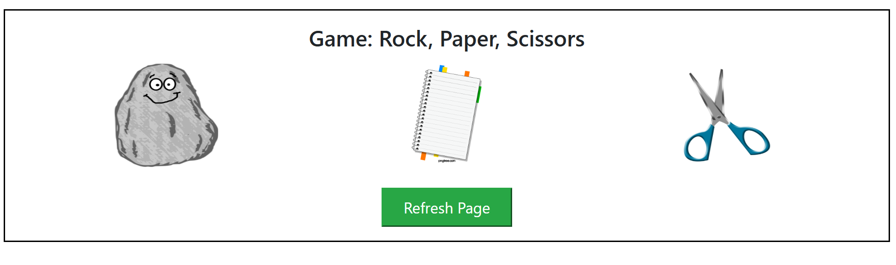

# 🎮 Rock Paper Scissors Game

A simple and interactive **Rock Paper Scissors** game built using **pure HTML, CSS, and JavaScript**.  
Play against the computer, test your luck, and enjoy a clean, minimal UI powered by Bootstrap.

---

## 🕹️ Demo
You can open the `index.html` file in your browser to play the game locally.  
(No server setup required!)

## 🧩 Play Live
[Rock Paper Scissors Demo](https://shahryartariq.github.io/Rock-Paper-Scissors/)  
Or open the `index.html` file in your browser to play locally — no server setup required!

---

## 🚀 Features
- 🪨 Rock, 📄 Paper, ✂️ Scissors gameplay
- 🧠 Random computer choice
- ⚖️ Automatic winner detection
- 🔄 Refresh button to play again
- 🎨 Clean and responsive Bootstrap-based design
- 💻 100% Vanilla JavaScript (no libraries or frameworks)

---

## 🧩 Technologies Used
- **HTML5**
- **CSS3**
- **JavaScript (ES6)**
- **Bootstrap 4**

## 🧠 How It Works
1. Click on **Rock**, **Paper**, or **Scissors**.
2. The computer randomly selects one.
3. The result is displayed showing whether you **win**, **lose**, or **tie**.
4. Click **Refresh Page** to play again.

## 🖼️ Screenshots
